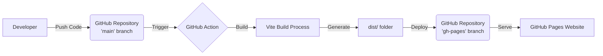
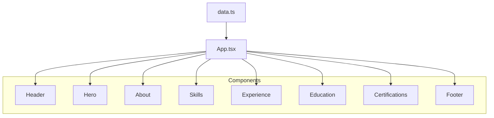

# Vaibhav Reddy Portfolio

This is a professional portfolio application for **Vaibhav Reddy**, built with modern web technologies. It showcases professional experience, skills, education, and certifications in a responsive and interactive format.

## 🏗 System Architecture

This project is a **Single Page Application (SPA)** built using **React** and **TypeScript**, bundled with **Vite**. It uses **Tailwind CSS** for styling and is designed for automated deployment to **GitHub Pages**.

### Tech Stack
-   **Frontend Framework**: [React](https://react.dev/) (v18+)
-   **Build Tool**: [Vite](https://vitejs.dev/)
-   **Language**: [TypeScript](https://www.typescriptlang.org/)
-   **Styling**: [Tailwind CSS](https://tailwindcss.com/)
-   **Icons**: [Lucide React](https://lucide.dev/)
-   **Deployment**: [GitHub Pages](https://pages.github.com/)

### Architecture Diagrams

#### Deployment Pipeline
The following diagram illustrates the continuous deployment flow:



#### Component Hierarchy
The application is structured as a component tree fed by a central data source:



## 🚀 Project Setup

Follow these instructions to set up the project locally for development.

### Prerequisites
-   **Node.js** (v18 or higher recommended)
-   **npm** (comes with Node.js) or `yarn`/`pnpm`/`bun`

### Installation

1.  **Clone the repository:**
    ```bash
    git clone https://github.com/YOUR_USERNAME/vaibhav-reddy-portfolio.git
    cd vaibhav-reddy-portfolio
    ```

2.  **Install dependencies:**
    ```bash
    npm install
    ```

### Development

Start the local development server:
```bash
npm run dev
```
The application will be available at `http://localhost:5173`.

### Production Build

Create a production-ready build:
```bash
npm run build
```
The output will be generated in the `dist` directory.

You can preview the production build locally:
```bash
npm run preview
```

## 🌿 Branch Information

-   **`main`**: The primary development branch. All source code changes, new features, and bug fixes should be committed here.
-   **`gh-pages`**: This branch is **automatically managed** by GitHub Actions. It contains the built artifacts (HTML, CSS, JS) ready for deployment. **Do not modify this branch directly.**

## ⚙️ GitHub Pages Setup

To ensure the portfolio is live and accessible, you must configure the repository settings to serve from the correct branch.

1.  **Verify the `gh-pages` branch exists:**
    -   Ensure a GitHub Action has successfully run after a push to `main`. This action will automatically create the `gh-pages` branch.

2.  **Configure Pages Settings:**
    -   Go to your repository on GitHub.
    -   Navigate to **Settings** > **Pages**.
    -   Under the **Build and deployment** section:
        -   Set **Source** to **Deploy from a branch**.
        -   Under **Branch**, select **`gh-pages`** from the dropdown menu.
        -   Ensure the folder is set to **`/(root)`**.
    -   Click **Save**.

3.  **Access the Site:**
    -   Once saved, GitHub will trigger a deployment. After a minute or two, your site will be live at:
        `https://<your-username>.github.io/<repo-name>/`

## 📁 Project Structure

```
.
├── components/       # React components (Header, Hero, etc.)
├── public/           # Static assets (images, favicon)
├── App.tsx           # Main application component
├── data.ts           # Centralized content/data file
├── index.html        # Entry HTML file
├── index.tsx         # React entry point
├── package.json      # Dependencies and scripts
├── tailwind.config.js # Tailwind configuration (if applicable)
├── tsconfig.json     # TypeScript configuration
└── vite.config.ts    # Vite configuration
```
